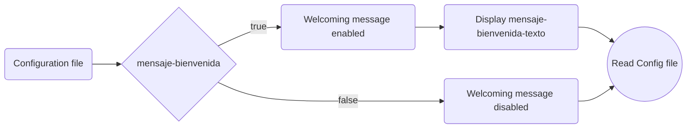

# Unk-Plugin

[DISCLAIMER] >> This plugin is written in Spanish.
This Basic Example was intended for educational, entertainment and learning purposes in object-oriented, class-based programming using APIs and third-party technologies focused on entertainment. Feel free to copy or modify parts of the code for your own use.
This Minecraft version 1.12.2 plugin has functions to moderate very basic needs on a server, such as:

- Server basic utilities

  > spawn, set-spawn, reload and scoreboards(not a command)

- Basic player needs
  > feed, fly, anunciar

Also, remember to download Vault, as it is a necessary dependency that the plugin needs to function normally

## YML Configuration File

UnkPlugin is configured via YML files, accepting this values:

| Config                   | Value     |
| ------------------------ | --------- |
| mensaje-bienvenida       | `boolean` |
| mensaje-bienvenida-texto | `string`  |

`mensaje-bienvenida` states if there will be a message when someone joins the server
`mensaje-bienvenida-texto` indicates the string of the message to display

